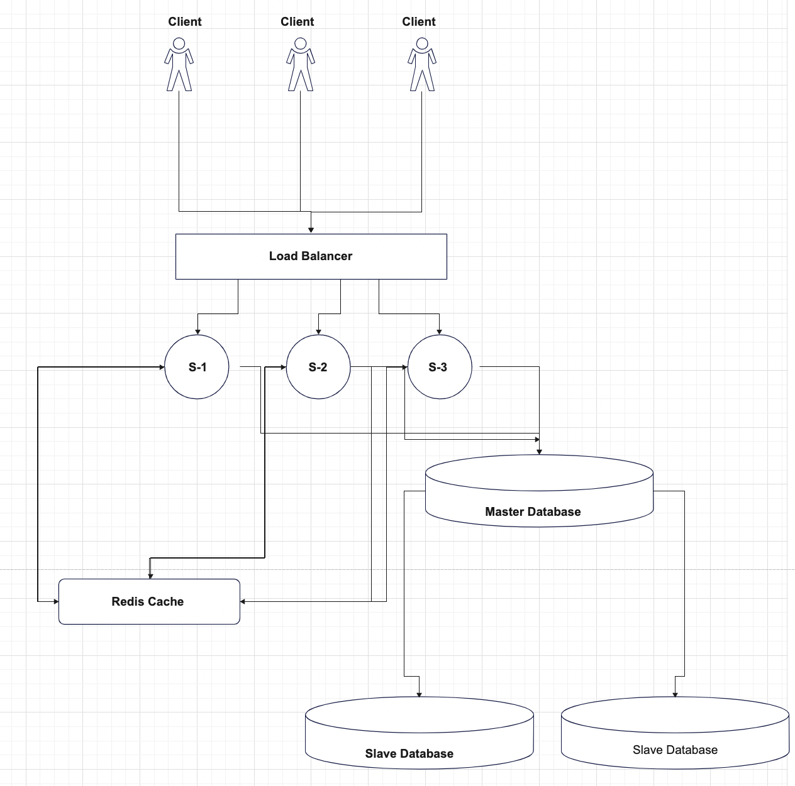

# Distributed-System-Project
Distributed System Project

## Team members
Kaif Shahahusen Jamadar

Haseeb Usmani

Muhammad Zeeshan Zafar

## Project description
The main idea of this project is to create a simple distributed system to achieve functionalities such as naming and node discovery, shared state among different nodes in the system, synchronization among databases, and possibly even consensus furthermore the system is designed in such a way that it is scalable. The idea is to create a booking application that helps users book movie tickets online. The user will have no idea about the different servers and the system will be able to perform the same way even if one of the servers fails, which means that this application will be fault tolerant. The client and the server will communicate with each other via HTTP methods. 

## Project Architecture


## Instructions to run the project

install node modules

```bash
cd booking/ && npm install && cd ../Server_1 && npm install && cd..
```

to start frontend 
```bash
cd booking/ && npm run start
```

open another terminal to backend server
```bash
cd Server_1/ npm run dev
```

## Environment Variables
Running the server direclty won't run as the server need mongoDB URL, redis URL. You will need to set up environment variables.

Quick set up for redis
```
https://dev.to/ramko9999/host-and-use-redis-for-free-51if
```

Quick set up for MongoDB
```
https://www.mongodb.com/docs/atlas/
```

## Deploy on fly
Check out the running application [Here](https://ds-booking.fly.dev/)

## Available Scripts
### `npm start`
Run the server

### `npm run dev`
Run the server in development mode.

### `npm run build:ui`
To build the front-end and copy the build to server 1 to be served statically

### `npm run deploy`
To deploy to fly

### `deploy:full`
To build the front-end then copy the build to server 1 and deploy to fly

### `logs:prod`
To print production logs
